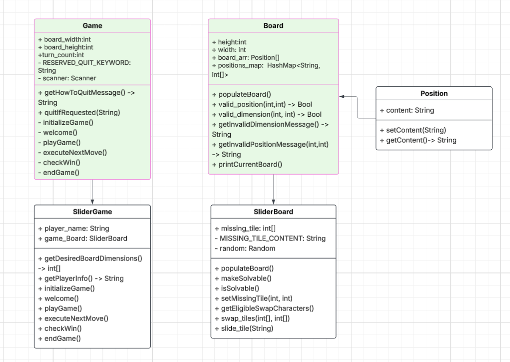

# Design Document
As of 09/14/2025

[Lucid UDL Diagram](https://lucid.app/lucidchart/c4758105-dcb7-4f60-9aa6-891e08487ba0/edit?viewport_loc=-1433%2C-796%2C2720%2C1338%2C0_0&invitationId=inv_051a835a-ac03-4296-b308-7640cd7b78cd)

## Class Design
Superclasses and their Subclasses are indicated by Subclasses
having the name of their Superclass at the end of their name.

I use Superclasses as Abstract Base Classes with minimal functionality
to use as a unified resource for all future `Boards` and `Games`.



### Inter Class Relationships
```agsl
Game > Board > Position(s)
SliderGame > SlideBoard > Position(s)
```

I used inheritance for **extendibility** so that I can quickly make new games / boards and modify them
with ease. In particular, I chose to make Position's contents of type String as it is the most
flexible for customization, but in the future may later change the contents to an object if needed.

I encouraged **scalability** by designing efficient ways to check if the user has won the game, using
multiple data structures to keep track of the progress of the game. I used a 2D array for the board itself,
but used a HashMap to keep track of the position of any tile content so that I can have `O(1)` lookups
when considering swaps and user action proposals.

## Changes 

### From Last Assignment
N/A

### For Future Assignments
Unknown